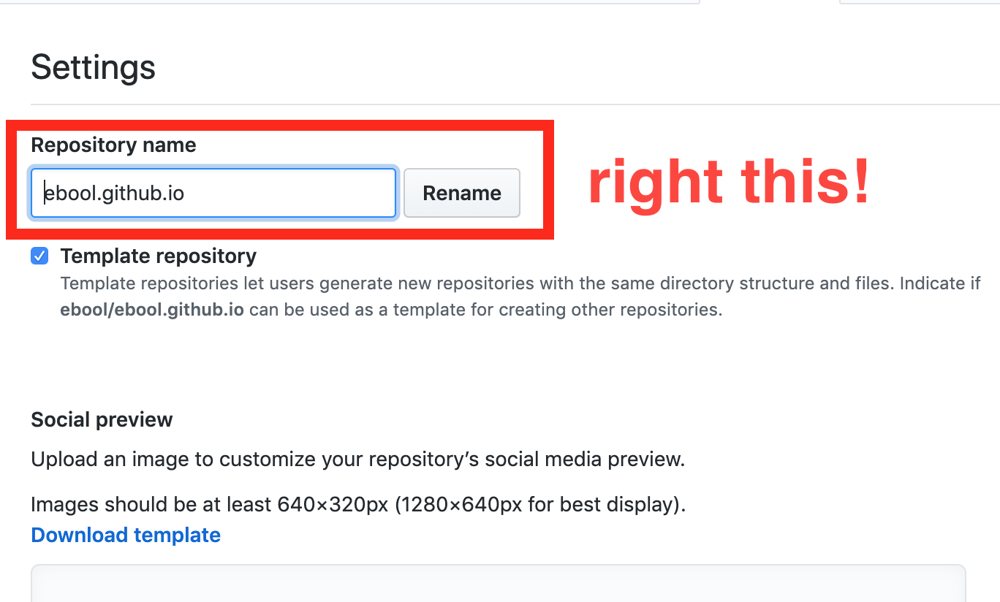

# jekyll-theme-webstorm

jekyll-theme with webstorm

## How to use.

### 1. Fork this project

 

### 2. Change your forked project name to the format with {your github user name}.github.io as follow: 

 

### 3. You can visit https://{your github user name}.github.io/ (In my case: [https://ebool.github.io/](https://ebool.github.io/){:target="_blank"})

 
